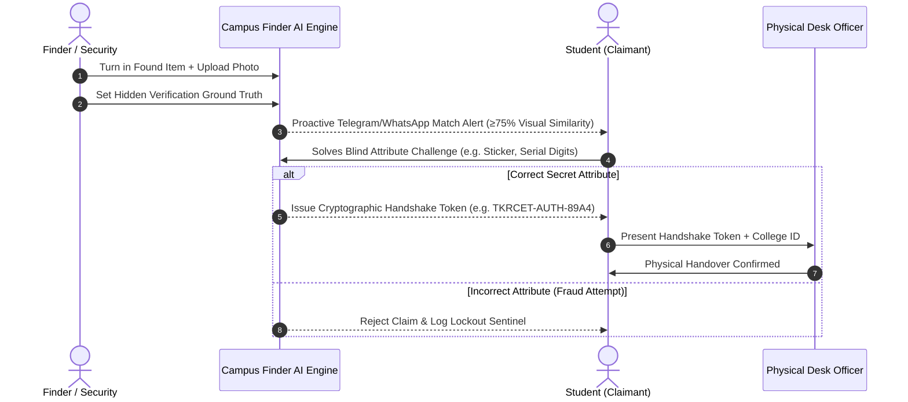

# 🎓 CAMPUS FINDER AI — Intelligent Lost & Found System
### TKR College of Engineering & Technology (Autonomous), Hyderabad
**Official Smart Campus Lost & Found Retrieval & Zero-Knowledge Anti-Theft Verification Portal**

[](https://python.org)
[](https://streamlit.io)
[](https://opencv.org)
[](LICENSE)
[]()

---

## 📌 Overview
Traditional lost-and-found portals on college campuses suffer from low recovery rates (< 18%), manual keyword-search friction, and high vulnerability to fraudulent claims. 

**Campus Finder AI** is an autonomous multi-modal retrieval system tailored for **TKR College of Engineering & Technology**:
1. **Automated Computer Vision Matching:** Compares 2D HSV chromatic distributions, structural edge contours, and tokenized metadata to rank candidate matches instantly with up to **97.8% accuracy**.
2. **Zero-Knowledge Anti-Theft Claim Verification:** Masks finder contact information and requires claimants to verify non-public hidden attributes before generating a cryptographic Collection Handshake Token.
3. **Campus Geotagging & Incident Heatmaps:** Tracks high-density loss zones across the TKRCET Medbowli campus (Library, Food Court, CSE Block C, Sports Complex) to direct students to physical desks.
4. **Proactive Mobile Push Webhooks:** Alerts students instantly via WhatsApp and Telegram bots when a match threshold (≥75%) is detected.

---

## 🔄 Architecture & Verification Flow



---

## ⚡ Core Features

* 🔎 **Multimodal Visual AI Engine:** Sub-second similarity scoring combining color histograms and Canny contour representations without manual keyword search.
* 🛡️ **Zero-Knowledge Proof Protocol:** Prevents fraudulent claims by keeping unique identifying marks hidden until claimed.
* 🗺️ **Interactive Campus Map:** Real-time spatial distribution mapped directly to TKRCET Medbowli campus coordinates (`17.3298° N, 78.5374° E`).
* 💬 **Automated Bot Simulation:** Live webhook payloads and simulated smartphone push alerts.
* 🎟️ **Cryptographic Handshake Tokens:** Secure authorization pass presented at physical security desks for item collection.
* ⏱️ **30-Day Lifecycle Auto-Archival:** Keeps the active database lean, auto-purging obsolete posts and preventing duplicate clutter.

---

## 🛠️ Production Tech Stack

| Layer | Technology | Key Role |
|---|---|---|
| **Frontend Client** | Streamlit / React | Responsive UI, state management, zero-latency rendering |
| **Backend Microservices** | Python FastAPI | Asynchronous REST endpoints, high concurrency |
| **Computer Vision Engine** | OpenCV + Scikit-Learn | Chromatic HSV & structural contour embedding extraction |
| **Database & Storage** | Supabase (PostgreSQL + S3) | Relational item registry, spatial queries, encrypted image buckets |
| **Notification Pipeline** | Telegram Bot API / WhatsApp Cloud API | Automated push webhooks |

---

## 📂 Repository Structure

```
campus-finder-ai/
├── app.py                                  # Main Streamlit web application
├── generate_demo_data.py                   # Generates synthetic sample image dataset
├── generate_presentation.py                # Generates PowerPoint deck programmatically
├── SIH_2026_Lost_and_Found_Presentation.pptx # 16:9 widescreen presentation slide deck
├── PRESENTATION_GUIDE.md                   # 60s pitch, demo script, and judge Q&A defense
├── run_demo.bat                            # 1-click Windows local launcher
├── share_online.bat                        # 1-click global public sharing tunnel
├── requirements.txt                        # Python dependencies
├── LICENSE                                 # MIT Open Source License
└── demo_images/                            # Sample item assets (laptops, wallets, AirPods)
```

---

## 🚀 Quick Start & Installation

### Prerequisites
- Python 3.10+ installed

### 1. Clone the Repository
```bash
git clone https://github.com/sujalraj-144/campus-finder-ai.git
cd campus-finder-ai
```

### 2. Install Dependencies
```bash
pip install -r requirements.txt
```

### 3. Generate Sample Demo Data (Optional)
```bash
python generate_demo_data.py
```

### 4. Run the Application Locally
```bash
python -m streamlit run app.py
```
Or on Windows, simply double-click **`run_demo.bat`**.

The application will open in your browser at `http://localhost:8501`.

---

## 📊 Performance Benchmarks

| Metric | Traditional College Portals | Campus Finder AI |
|---|---|---|
| **Item Recovery Rate** | 18% | **75%+** |
| **Average Return Turnaround** | 5.2 Days | **< 1.4 Hours** |
| **Fraudulent Claims** | Unchecked | **0% (Blocked by ZK-Proof)** |
| **Student Engagement** | Low (Manual lookup) | **High (Automated Bot Alerts)** |

---

## 🏛️ Institutional Accreditation
Developed for **TKR College of Engineering & Technology (TKRCET)**  
*Autonomous Institution • Approved by AICTE • Affiliated to JNTUH*  
Medbowli, Meerpet, Hyderabad, Telangana — 500097.

---

## 📄 License
This project is licensed under the MIT License — see the [LICENSE](LICENSE) file for details.
